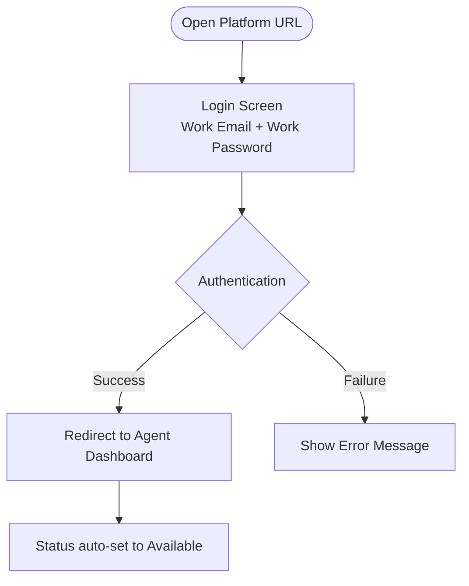

# Agent User Journey — Masdr CX Platform
### Complete end-to-end walkthrough of everything an Agent can see, do, and manage

---

## Table of Contents
1. [Role Overview](#1-role-overview)
2. [Login & Authentication](#2-login--authentication)
3. [Agent Dashboard](#3-agent-dashboard)
4. [Incoming Call & Live Call](#4-incoming-call--live-call)
5. [All Interactions (Call History)](#5-all-interactions-call-history)
6. [Leaderboard](#6-leaderboard)
7. [Contact Us (Requests)](#7-contact-us-requests)
8. [Status Management](#8-status-management)
9. [Full Navigation Map](#9-full-navigation-map)

---

## 1. Role Overview

| Attribute | Value |
|---|---|
| Role name in system | Agent |
| Landing page after login | /service/agent/dashboard |
| Example agent shown | OPD Agent 04 / Labeeb Agent One |

**What makes the Agent unique:**
- Focused, individual-scope view — sees only their own calls, ratings, and performance
- Receives incoming video/voice calls and handles customer interactions directly
- Can manage their own availability status (Available / Away / In Call)
- Has a gamification leaderboard showing their personal ranking relative to colleagues
- Can submit support requests via the Contact Us module
- Cannot monitor other agents, see team-wide data, or manage content
- Cannot access Live Calls monitoring, Agents List, Content Management, or Performance Dashboard (those are Supervisor/Admin features)

---

## 2. Login & Authentication



**Key behaviours:**
- Agent is redirected to their personal dashboard upon successful login
- Status defaults to **Available** on login
- Session is stored in `localStorage.authUser`

---

## 3. Agent Dashboard

**Route:** `/service/agent/dashboard`

The dashboard is the Agent's home screen and is divided into three major areas.

### 3.1 Top Summary Cards


| Card | What it shows |
|---|---|
| **Points Gained** | Total gamification points earned (e.g. 21) |
| **Completed** | Number of successfully completed calls (e.g. 05) |
| **Missed** | Number of missed calls (e.g. 01) |

Each card has a `→` arrow for drilling into more detail.

### 3.2 Performance Overview


**Client Rating panel:**
- Star breakdown (5 → 1 stars) with count per rating level
- Current average score shown (e.g. **2.5**)
- Total number of clients who rated

**Call Duration panel:**
- Average call duration (e.g. **0m 56s**)
- Total calls count (e.g. **5**)
- Split view: completed calls (green) vs missed calls (red)
  - e.g. **4 Calls** completed | **1 Call** missed

### 3.3 Recent Calls & Last 5 Feedbacks


Displays the last few interactions at a glance:

| Column | Description |
|---|---|
| Client Details | Client name + ID |
| Client Number | Phone number (or `-` if unavailable) |
| Status | Completed (green) / Missed Calls (amber) |
| Time of Call | Date and timestamp |
| Call Duration | Duration string (e.g. `02m 12s`) |

A **"View More →"** button navigates to the full All Interactions screen.

**Last 5 Feedbacks** sidebar shows the most recent client feedback messages, e.g.:
- **IMRAN KHAN** — *"service fb testing leader board"*
- **IMRANTEST** — *"Camera is working fine"*

### 3.4 Dashboard Filter

- **Date range filter** — defaults to current month (e.g. `01-04-2026 – 14-04-2026`)
- **Service group selector** — filters data by service group (e.g. `4_OverallPerfDashboard`)

---

## 4. Incoming Call & Live Call

### 4.1 Incoming Call Notification


When a customer initiates a call, the agent sees a **pop-up panel** in the top-right corner of the screen containing:

| Field | Example |
|---|---|
| Call type | Incoming video call |
| Caller name | Mohd Aadil |
| Language | ENGLISH |
| Service group | 4_OverallPerfDashboard |
| Action button | **Accept call** (green) |

- Agent status in the sidebar changes to **"In Call"**
- Agent can accept or ignore the notification

### 4.2 Active Video Call Screen


Once the call is accepted, the agent enters the full-screen call interface:

```
┌──────────────────────────────────────────────────────┐
│  Service group: 4_OverallPerfDashboard    [English]  │
│  Mohd Aadil  ID: 2222222222  [More ▾]               │
│                                                      │
│        ┌─────────────────────────────────┐           │
│        │         Customer video          │           │
│        │              MO                 │           │
│        │  ┌────────┐          [Mohd🔇]  │           │
│        │  │  You 🎤│                    │           │
│        └──┴────────┴────────────────────┘           │
│                                                      │
│ ● Rec [00:23]  🎤Audio  📷Video  🖥Share  👤Ask  ⏸Hold │
│                              [🔴 End Call]            │
└──────────────────────────────────────────────────────┘
```

**Call toolbar controls:**

| Button | Function |
|---|---|
| Audio | Mute/unmute microphone (with dropdown) |
| Video | Turn camera on/off (with dropdown) |
| Share screen | Share agent's screen with the customer |
| Ask to join | Request an agent or supervisor to join the call |
| Hold Call | Place the call on hold |
| End Call | Terminate the call |

**Recording indicator:**
- `● Rec` with a running timer (e.g. `00:23`) shows the call is being recorded
- A tooltip reads *"your call is being recorded"*

### 4.3 Transfer Call & In-Call Messages


**Top-right action buttons:**
- **Messages** — opens the In-Call messages panel (real-time chat with the customer during the call)
- **Transfer call ▾** — dropdown with two options:
  - Transfer to an agent
  - Transfer to a supervisor

**In-Call Messages panel** (slides open on the right):
- Chat log area (empty until messages are sent)
- Text input: *"Send a message…"* with send and attachment buttons

### 4.4 Ask to Join (Supervisor/Agent)


Clicking **Ask to join** opens a modal: **"Request an agent or supervisor to join"**

| UI Element | Detail |
|---|---|
| Tabs | All (1) / Agents (0) / Supervisors (1) |
| Service group filter | Dropdown (e.g. `4_OverallPerfDashboard`) |
| Search | Search by agent or supervisor name |
| Participant list | Shows name, role badge, and availability status |
| Action button | **Request to join now →** |

### 4.5 Join Request Progress


After requesting, a progress tracker appears:

```
✅ Contacted selected supervisor
   SupervisorOPD Two  •  4_OverallPerfDashboard

✅ Supervisor accepts or declines the call

⬜ Supervisor joins the call
```

- A top-right toast notification confirms: **"Join Request Initiated — You have initiated a join request"**
- A **Cancel this request** button is available if the agent changes their mind

### 4.6 Supervisor Joined — Screen Sharing View


Once the supervisor joins and shares their screen, it is visible in the main call area alongside all participant tiles (You, Customer, SupervisorOPD Two). Each tile is labelled with the participant's name and mute indicator.

---

## 5. All Interactions (Call History)

**Route:** `/service/agent/allInteractions`


- Title: **Call History**
- Auto-refresh indicator: *"Updated every 10s"*

### 5.1 Filter Bar

**Filter by Rating:**

| Filter | Count |
|---|---|
| All | 5 |
| ⭐ 1 | 0 |
| ⭐⭐ 2 | 0 |
| ⭐⭐⭐ 3 | 0 |
| ⭐⭐⭐⭐ 4 | 0 |
| ⭐⭐⭐⭐⭐ 5 | 0 |
| No Rating | 5 |

Additional controls:
- **Search bar** — search by Name / Mobile Number / ID Number
- **Date range picker** — e.g. `01-04-2026 – 14-04-2026`
- **Clear Filters** button
- **Export Report** button (purple)

### 5.2 Call History Table

| Column | Description |
|---|---|
| ☐ | Checkbox for bulk selection |
| Client Details | Name + ID (e.g. `IMRAN KHAN / ID: 1212121212`) |
| Client Number | Phone number or `-` |
| Status | Completed (green) / Missed Calls (amber) |
| Time of Call | Date + time (sortable ↕) |
| Call Duration | Duration string (sortable ↕) |
| Call Rating | Star rating or `-` |
| Attached Media | Media files or `-` |

**Pagination:** Rows per page selector (default: 10) with Previous / Next navigation.

---

## 6. Leaderboard

**Route:** `/service/agent/leaderboard`


### 6.1 Filter Bar

- **Date range** — e.g. `01/02/2026 – 14/04/2026`
- **Level selector** — e.g. **Company Level**

### 6.2 Top Performers Spotlight

Top 2 agents are highlighted in large cards:

| Field | Agent 1 Example | Agent 2 Example |
|---|---|---|
| Name | OPD Agent 04 | OPD Agent 06 |
| Calls | 10 | 1 |
| Rating Avg. | 4.5 | 5 |
| Point | 40 | 5 |
| Medal | 🥇 (Gold) | 🥈 (Silver) |

A third-place medal icon (🥉) appears on the right when applicable.

### 6.3 Agent List Table

Full ranked list of agents:

| Column | Description |
|---|---|
| Rank | Numeric rank (1, 2, 3…) |
| Name | Agent name (current agent's row highlighted in teal) |
| Avg Rating | Average client rating |
| Calls | Total calls handled |
| Average Call Duration | Mean call length (or `-`) |
| Points ⓘ | Gamification points total |

### 6.4 Streak Panel

A sidebar panel showing the current activity streak:

| # | Agent | Streak |
|---|---|---|
| 1 | OPD Agent 04 | 3 🔥 |

---

## 7. Contact Us (Requests)

**Route:** `/service/agent/contactUs`


Agents can raise support tickets / requests directly to supervisors.

### 7.1 Filter Status Bar

| Status | Count |
|---|---|
| All | 3 |
| In progress | 1 |
| Approved | 0 |
| Rejected | 0 |
| Open | 2 |
| On hold | 0 |
| Escalated | 0 |
| Closed | 0 |

### 7.2 Requests Table

| Column | Description |
|---|---|
| Ticket Number | e.g. `#193`, `#190`, `#181` |
| Request Subject | Short description of the request |
| Request Status | Coloured badge (Open / In progress / Approved etc.) |
| Creation Date | Date and time created |
| Last update | Date and time of last update |
| Updated by | Name of the person who last updated (e.g. `Labeeb Supervisor QA`) |
| Action | **View Request** link |

### 7.3 Add New Request

- **+ Add new request** button (purple, top-right) opens a form to create a new ticket
- **Date range filter** available to filter by creation date

### 7.4 Open Chat

- A floating **Open Chat** button (bottom-right corner) is available for instant messaging support

---

## 8. Status Management

The agent's status is visible in the **bottom-left sidebar** at all times.

### Available States

| Status | Colour | Trigger |
|---|---|---|
| Available | 🟢 Green | Default on login; manually set |
| Away | 🟡 Grey | Manually set by agent |
| In Call | 🟢 Green (special) | Automatically set when a call is active |

### How to Change Status
1. Click on the status badge (e.g. `● Available ▾`) next to the agent's name in the bottom-left
2. A dropdown appears with status options
3. Select the desired status

---

## 9. Full Navigation Map

```
Masdr CX — Agent View
│
├── 📊 Dashboard
│   ├── Summary cards (Points / Completed / Missed)
│   ├── Performance Overview
│   │   ├── Client Rating breakdown
│   │   └── Call Duration stats
│   ├── Recent Calls table
│   └── Last 5 Feedbacks
│
├── 📋 All Interactions (Call History)
│   ├── Filter by rating / date / search
│   ├── Export Report
│   └── Paginated call log table
│
├── 🏆 Leaderboard
│   ├── Top performers spotlight
│   ├── Full agent rankings table
│   └── Streak panel
│
├── 📞 Live Call (contextual — appears when in a call)
│   ├── Video/audio call interface
│   ├── Call controls (mute, video, hold, end)
│   ├── Screen sharing
│   ├── In-call messaging
│   ├── Transfer call (to agent / supervisor)
│   └── Ask to join (agent / supervisor)
│
└── 📩 Contact Us
    ├── Requests list with status filters
    ├── Add new request
    └── Open Chat (floating button)
```

---

*Document generated from Masdr CX platform screenshots — Agent perspective (OPD Agent 04 / Labeeb Agent One)*
